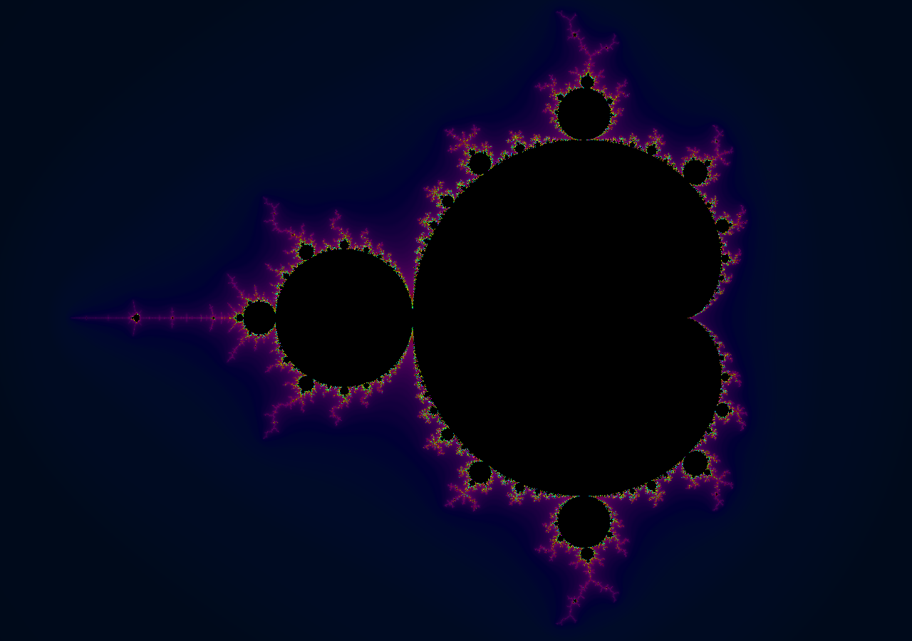
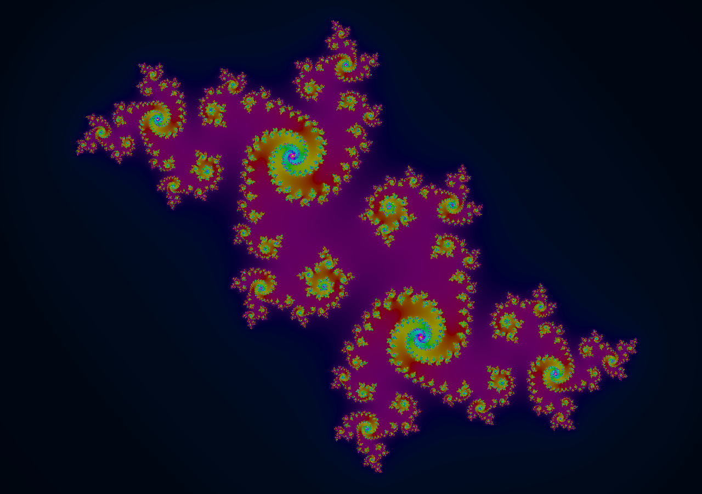

# Fractality

Simple and fast fractal visualizer.

## Overview

The fractal is calculated by iterating the equation

$z_n = z_{n-1}^p + c$

where $z_n$, $c$, and $cp$ are complex number paramters.

If $z_n$ stays bounded, the point is contained in the fractal,
otherwise, if it blows up to infinity,
it is colored based on how many iterations it took it to escape.

The real and imaginary components of $z_{0}$, $c$, and $p$ can be set to
constant values or parametrized over the $X$ or $Y$ coordinates.

### Parameters

| Prameter        | Description                                                                                                                                                                               |
| --------------- | ----------------------------------------------------------------------------------------------------------------------------------------------------------------------------------------- |
| Iteration Count | How many iterations to calculate. The higher the number, the more detailed the image, however, high iteration count might hurt performance or cause the application to crash.             |
| Escape Radius   | If the iterated point crosses this radius, it is considered to be escaped.                                                                                                                |
| Initial Z       | $z_0$ at the start of the calculation.                                                                                                                                                    |
| C               | $c$ at the start of the calculation.                                                                                                                                                      |
| Exponent        | $p$ at the start of the calculation.   Note that exponents other than 2, non-integer exponents, or exponents having a non-zero imaginary component will be more expensive to calculate |

## Interesting fractals

#### Mandelbrot set

| Parameter | real         | imaginary    |
| --------- | ------------ | ------------ |
| Initial Z | 0.0          | 0.0          |
| C         | X coordinate | Y coordinate |
| Exponent  | 2.0          | 0.0          |

#### Julia set

| Parameter | real            | imaginary       |
| --------- | --------------- | --------------- |
| Initial Z | X coordinate    | Y coordinate    |
| C         | \<any constant> | \<any constant> |
| Exponent  | 2.0             | 0.0             |

## Planned future features

- [ ] Double precision
- [ ] Coloring options
- [ ] More equations
- [ ] Display the path of a single point
- [ ] Using cursor position as a parameter
- [ ] Rendering and performance improvements
- [ ] Displaying multiple fractals at the same time
